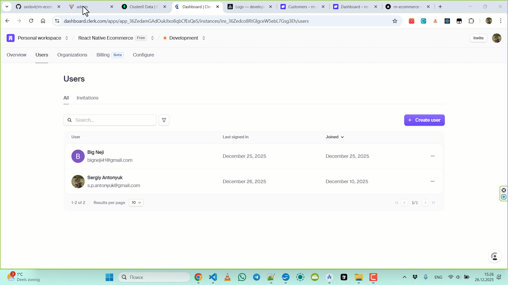
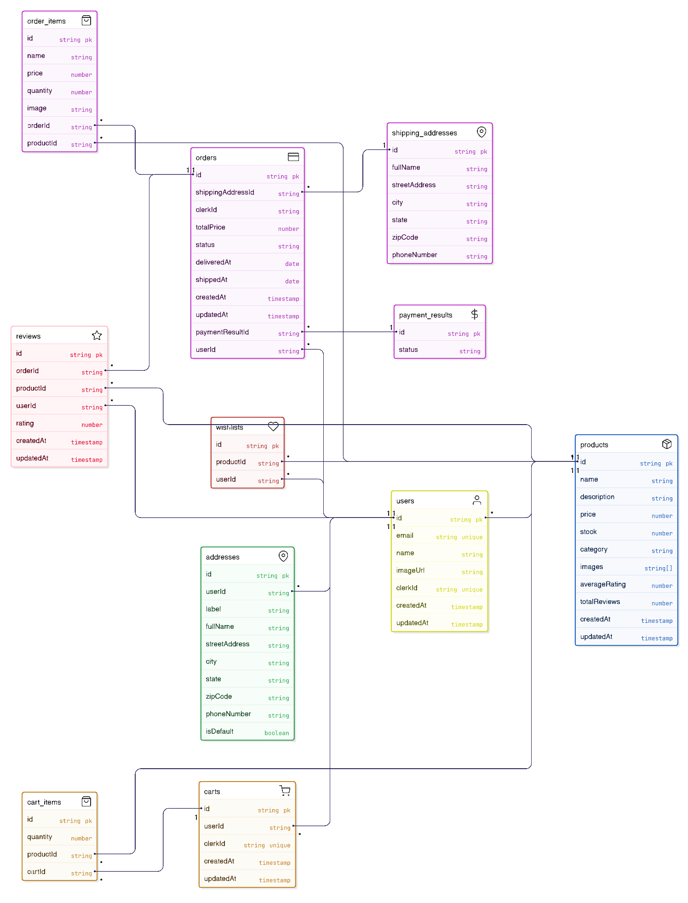

## E-Commerce (React Native + React + Express)

##### _A full-featured E-commerce application including a mobile client (Expo), admin panel (React + Vite), and a powerful backend (Node.js + Express). The project is built on a modern tech stack using Inngest for background jobs and Clerk for authentication._

[](https://deepwiki.com/sxidsvit/rn-ecommerce)

---

## 🛠️ Tech Stack

### 📱 Mobile App

- Framework: React Native (via Expo)
- Styling: NativeWind & TailwindCSSЫ
- Routing: Expo Router
- Auth: Clerk
- Monitoring: Sentry
- Framework: React Native (via Expo)
- Styling: NativeWind & TailwindCSSЫ
- Routing: Expo Router
- Auth: Clerk
- Monitoring: Sentry

### 💻 Frontend (Admin Dashboard)

- Framework: React.js + Vite
- UI Kit: Shadcn/ui + TailwindCSS
- State Management: TanStack Query
- Auth: Clerk (React SDK)
- Framework: React.js + Vite
- UI Kit: Shadcn/ui + TailwindCSS
- State Management: TanStack Query
- Auth: Clerk (React SDK)

### ⚙️ Backend (API)

- Runtime: Node.js
- Framework: Express.js
- Database: MongoDB (Mongoose)
- Background Jobs: Inngest (Serverless queues)
- Image Storage: Cloudinary
- Payments: Stripe
- Runtime: Node.js
- Framework: Express.js
- Database: MongoDB (Mongoose)
- Background Jobs: Inngest (Serverless queues)
- Image Storage: Cloudinary
- Payments: Stripe

---


---



---


---

## ✨ Key Features

- Authentication: Secure login via Google/Email using Clerk.
- Product Management: Full CRUD for products, categories, and brands via the admin panel.
- Cart & Orders: Cart synchronization, checkout process, purchase history.
- Payments: Stripe integration for payment processing.
- Background Jobs: Using Inngest for event processing (e.g., sending emails after purchase).
- Media: Image upload and optimization via Cloudinary.
- Monitoring: Error tracking with Sentry.

## 📂 Database structure

## 

## 🚀 Run Locally

Follow the instructions below to configure each component of the system.

### Prerequisites

- Node.js (v18+)
- MongoDB (local or Atlas)
- Accounts in Clerk, Cloudinary, Inngest
- Node.js (v18+)
- MongoDB (local or Atlas)
- Accounts in Clerk, Cloudinary, Inngest

1. Clone the repository

git clone [https://github.com/sxidsvit/rn-ecommerce.git](https://github.com/sxidsvit/rn-ecommerce.git)
cd rn-ecommerce

2. Backend Setup

Navigate to the backend folder, install dependencies, and configure environment variables.

cd backend
npm install

Create a .env file in the root of the backend folder and add:

```bash
NODE_ENV=development
PORT=3000
DB_URL=your_mongodb_connection_string
CLERK_PUBLISHABLE_KEY=pk_test*...
CLERK_SECRET_KEY=sk_test*...
INNGEST_SIGNING_KEY=your_inngest_key
CLOUDINARY_API_KEY=your_cloudinary_key
CLOUDINARY_API_SECRET=your_cloudinary_secret
CLOUDINARY_CLOUD_NAME=your_cloud_name
ADMIN_EMAIL=admin@example.com
CLIENT_URL=http://localhost:5173
```

Start the server: npm run dev

3. Admin Frontend Setup

Navigate to the admin panel folder (usually admin or frontend).

cd ../admin
npm install

Create a .env file in the root of the admin folder:

```bash
VITE_CLERK_PUBLISHABLE_KEY=pk_test...
VITE_API_URL=http://localhost:3000
VITE_SENTRY_DSN=<YOUR_SENTRY_DSN>
```

Start the client: npm run dev

4. Mobile App Setup

Navigate to the mobile app folder.

cd ../mobile
npm install

Create a .env file in the root of the mobile app folder:

```bash
PUBLIC_CLERK_PUBLISHABLE_KEY=pk_test
SENTRY_AUTH_TOKEN=<YOUR_SENTRY_DSN>
```

Start Expo: npx expo start

### 📂 Project Structure

rn-ecommerce/
├── admin/ # React Admin Dashboard
├── backend/ # Node.js/Express API
└── mobile/ # React Native Expo App

### 📂 Deploy links

- Admin Panel https://rn-ecommerce-admin.vercel.app

- Backend API https://rn-ecommerce-backend.vercel.app

### 📬 Connect with me

<a href="https://www.linkedin.com/in/sergiy-antonyuk/" target="_blank">

</a>

#### 🙏 Acknowledgements

A heartfelt thank you to [Codesistency](https://www.youtube.com/@codesistency/featured) for his invaluable contributions
